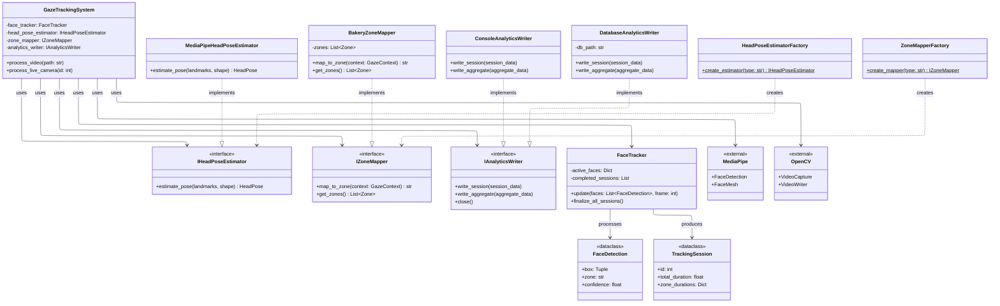
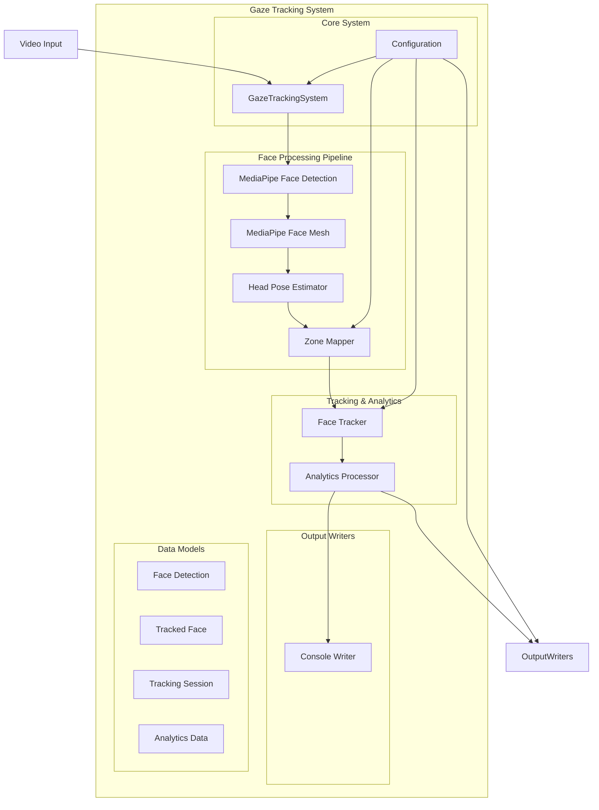
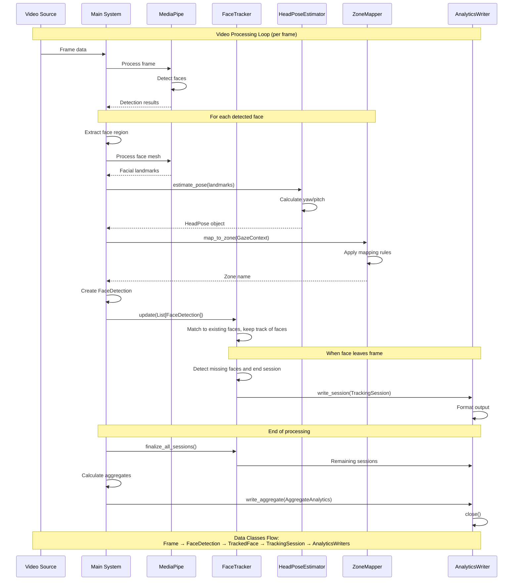

# Gaze Tracking System - Low Level Design UML Diagram

## Class Diagram

## Component Diagram

## Sequence Diagram for Video Processing

## Key Design Patterns Used

1. **Factory Pattern**: `HeadPoseEstimatorFactory` and `ZoneMapperFactory`
2. **Strategy Pattern**: Different implementations of `IHeadPoseEstimator` and `IZoneMapper`
3. **Observer Pattern**: Session callbacks in `FaceTracker`
4. **Template Method**: Base processing pipeline in `GazeTrackingSystem`
5. **Data Transfer Objects**: `FaceDetection`, `TrackedFace`, `GazeRecord`, etc.

## System Architecture Highlights

- **Modular Design**: Clear separation of concerns with dedicated modules for each responsibility
- **Interface-based Design**: Uses abstract interfaces for extensibility
- **Configuration-driven**: System behavior controlled via JSON configuration
- **Multi-output Support**: Analytics can be written to console, database, and JSON simultaneously
- **Real-time Processing**: Supports both video files and live camera feeds
- **Extensible Zone Mapping**: Easy to add new zone configurations for different physical spaces
